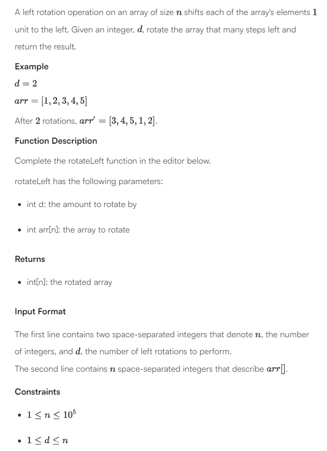

```
Sample input
5 4
1 2 3 4 5

Sample output
5 1 2 3 4
```

Solution

There are 2 ways

1. Time: O(n), Space: O(n)

Create a new array that

```python
new_arr[i] = arr[(i + d) % n]
```

-   Mistake 1: Didn't use new array -> order of data in input array is a mess -> failed

Reasonalbe way, just remember to use new array because we will shuffle elements of input array

2. Time: O(n) , Space: O(1)

Trick: Reverse twice

abcd|ef --> ef|abcd\
= abcd|ef --> fe|dcba --> ef|abcd

-   Mistake 2: in reverseArray, use i as `0 --> (b - a) // 2 + 1` instead of `a -> size // 2 + 1`

Tricky way, but worth to remember
