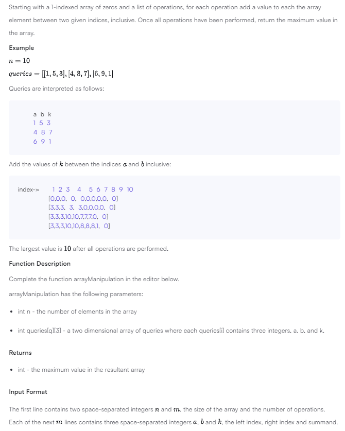

```
example:

input
a b k
1 5 3
4 8 7
6 9 1

output
index->	 1 2 3  4  5 6 7 8 9 10
	    [0,0,0, 0, 0,0,0,0,0, 0]
	    [3,3,3, 3, 3,0,0,0,0, 0]
	    [3,3,3,10,10,7,7,7,0, 0]
	    [3,3,3,10,10,8,8,8,1, 0]

==

sample input
5 3
1 2 100
2 5 100
3 4 100

sample output
200
```

note

quite tricky that to adapt the time complexity (reduce from O(m(b - a)) to O(m + n)) we need to know a trick that mark arr[a-1] to k and arr[b] to -k

the idea is we don't need to loop every items from a to b, we just need to mark that the k is added from a (+k) and stop in b + 1 (-k). then we prefix sum array that to perform the behavior of assign every items from a to b in the beginning, then we can find the max item of result array

good to know:

-   the trick to mark +k/-k
-   prefix sum array

hmmm

i still don't know why the failed solution runtime error lol, it worked in my local
